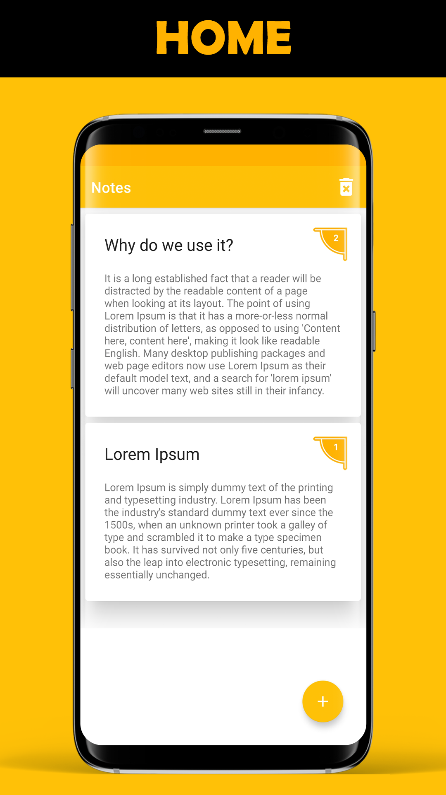
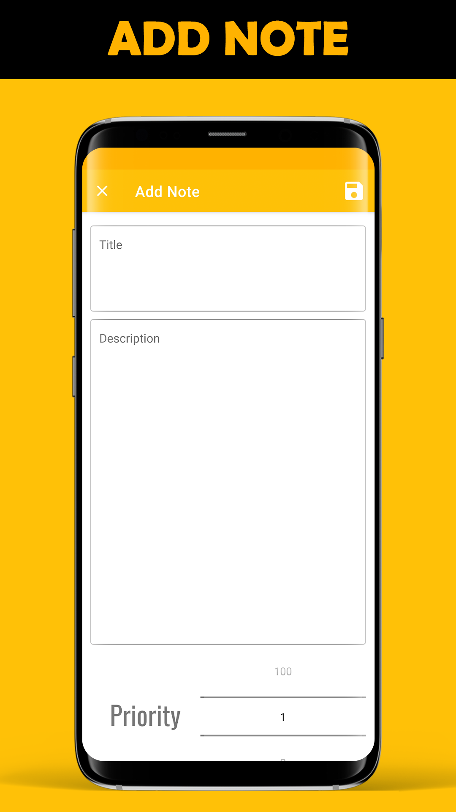
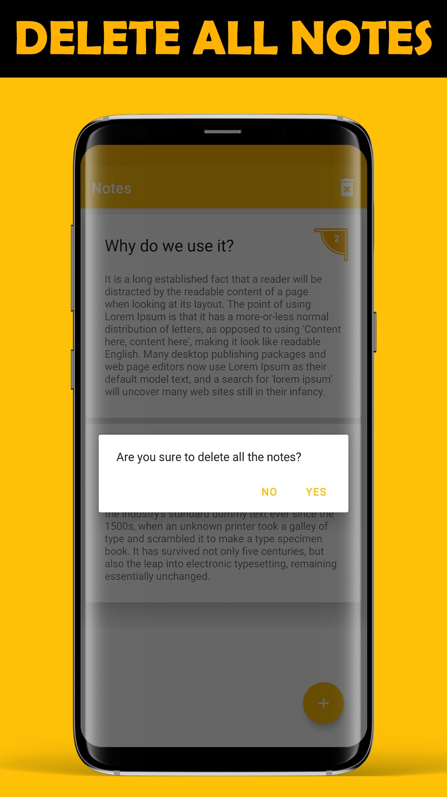

# Adorsholipi
https://play.google.com/store/apps/details?id=com.rakib.notesmvvmarchitecture

Note is a good helper to manage your schedule, thoughts and ideas. 
This simple note will give you a quick smooth editing and writing experience while you write, edit or even save your notes.

# Key feature:
* Very lightweight
* Totally offline
* Fast writing, editing and saving experience

# SCREENSHOTS

# HOME

# ADD NOTES

# SWIPE LEFT TO DELETE

# SWIPE RIGHT TO DELETE

# DELETE ALL NOTE

